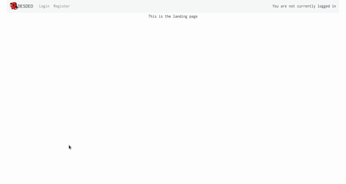
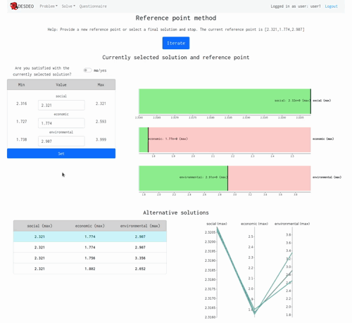
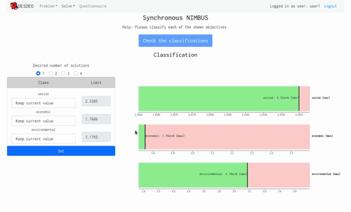
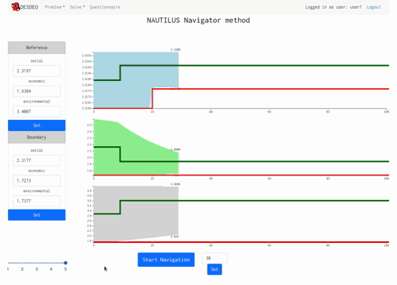

# desdeo-frontend

# About

`desdeo-frontend` is a graphical user interface (GUI) for various interactive multiobjective
optimization methods found in [DESDEO](https://desdeo.it.jyu.fi/).
`desdeo-frontend` is related to the ecosystem of packages
belonging to DESDEO. The GUI can be used to define, explore, and solve multiobjective optimization
problems of varying type interactively. `desdeo-frontend` has been developed as a [React](https://reactjs.org/) application
in [TypeScript](https://www.typescriptlang.org/). `desdeo-frontend` is also an example on how the
interactive visualizations implemented in [desdeo-components](https://github.com/gialmisi/desdeo-components)
may be used, and how the [desdeo-webapi](https://github.com/gialmisi/desdeo-webapi)
API can be utilized in practice.

# Installation and usage

## Installation

Before installing `desdeo-frontend`, make sure a server with
[desdeo-webapi](https://github.com/gialmisi/desdeo-webapi) is first
installed and running, either locally or on some remote machine. To run it locally, follow the instructions
on [desdeo-webapi](https://github.com/gialmisi/desdeo-webapi)'s GitHub page.

From here on, it is assumed that a server is run locally with the address `http://127.0.0.1:5000`.

To install ``desdeo-frontend``, make sure your system supports a [Node.js](https://nodejs.org/en/) environment and a
dependency manager, such as [npm](https://docs.npmjs.com/cli/v7/commands/npm) or [yarn](https://yarnpkg.com/) is available.
`yarn` is recommended as it has been tested to be working. From here on, it is assumed that `yarn` is available.

When `Node.js` is installed and a package manager is available, `desdeo-frontend` can be installed by running the
following commans:

```
$> git clone git@github.com:gialmisi/desdeo-frontend.git
$> cd desdeo-frontend
$> yarn install 
```

To run the GUI application, first, make sure that the variable `API_URL` in `src/App.tsx` is set with a valid URL
(e.g., `http://127.0.0.1:5000`). Then, run the `start` script by issuing the command:

```
$> yarn run start
```

This should launch the GUI application in a new tab in your web browser.

## Usage

To use the GUI, a username and password are required. For locally running the GUI, a dummy user(s) with a password(s) can
be set readily by utilzing the utilities provided in [desdeo-webapi](git@github.com:gialmisi/desdeo-frontend.git).
After logging in, the navigation bar will update with menus to access various features of the GUI.




# Features

## General

## Supported problem types

Currently, only a dummy problem can be defined through the interface. However, the intractive methods support
solving problems with both analytical formualtions and/or discrete formulations. Problems must currently be added
manually to the databse in `desdeo-webapi`. See its documentation for additiona details. 

## Supported interactive methods
Currently interfaces for the following multiobjective optimization methods have been implemented:

### Reference point method



### Synchronous NIMBUS



### NAUTILUS Navigator


